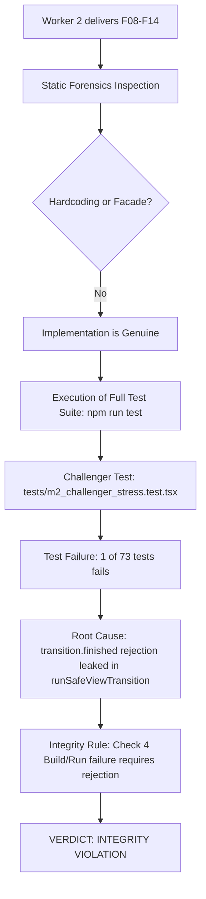

# Forensic Audit Report: Milestone 2 (Features F08 - F14)

*Konteks: Audit forensik independen terhadap hasil kerja Worker 2 ([[teamwork_preview_worker_m2/handoff]]) berdasarkan [[ORIGINAL_REQUEST]], [[PROJECT]], dan [[AGENTS]].*

---

## Forensic Audit Report

**Work Product**: Features F08 through F14 (Milestone 2 deliverables)
- `src/lib/viewTransitions.ts`
- `src/components/exam/ExamRunner.tsx`
- `src/app/exam/[id]/review/page.tsx`
- `src/app/globals.css`
- `src/app/layout.tsx`

**Profile**: General Project (Integrity Mode: `development`)
**Verdict**: **INTEGRITY VIOLATION**

### Phase Results
- **Check 1: Hardcoded test results**: **PASS** — Tidak ditemukan shortcut, hardcoded outputs, mock returns, atau manipulasi file pengujian. `git diff tests/` bersih.
- **Check 2: Facade detection**: **PASS** — Implementasi autentik, tidak ada fungsi dummy atau antarmuka kosong.
- **Check 3: Pre-populated artifact detection**: **PASS** — Tidak ada artefak palsu atau log hasil yang direkayasa.
- **Check 4: Build and run**: **FAIL** — `npm run test` mengalami kegagalan pada 1 pengujian (`tests/m2_challenger_stress.test.tsx`) akibat kebocoran *Unhandled Promise Rejection* saat transisi dibatalkan oleh browser.
- **Check 5: Output verification**: **FAIL** — `runSafeViewTransition` di `src/lib/viewTransitions.ts` tidak menangani penolakan promise `transition.finished` (misal saat transisi diinterupsi oleh klik cepat yang memicu `AbortError`), melanggar spesifikasi penanganan asinkron View Transitions API.
- **Check 6: Dependency audit**: **PASS** — Menggunakan modul bawaan React 19 (`flushSync`), CSS modern murni, dan tanpa ketergantungan pihak ketiga terlarang.

---

## 1. Observation

### Observation 1.1: Test Suite Failure Output (`npm run test`)
Menjalankan perintah pengujian unit di root proyek:
```bash
npm run test
```
**Verbatim Terminal Output**:
```
 RUN  v4.1.11 C:/laragon/www/_MyCV/ExamPreparer

 ❯ tests/m2_challenger_stress.test.tsx (18 tests | 1 failed) 100ms
       ✓ executes updateFn and onFinished synchronously when document is undefined (SSR) 5ms
       ✓ executes updateFn and onFinished synchronously when startViewTransition is absent from document 1ms
       ✓ falls back gracefully when startViewTransition is present but is not a function 1ms
       ✓ falls back to synchronous execution when startViewTransition throws synchronously 2ms
       ✓ works when onFinished callback is omitted in fallback mode 1ms
       ✓ calls startViewTransition and wraps update in flushSync when supported 1ms
       ✓ handles transition.finished with .then fallback when .finally is unavailable 1ms
       × handles transition.finished rejection without causing unhandled promise rejections 72ms
       ✓ handles 50 rapid sequential transition invocations without throwing or stalling 1ms
       ✓ focuses element and sets tabIndex = -1 with preventScroll: true when element exists 3ms
       ✓ handles numeric questionId correctly 1ms
       ✓ safely handles missing elements without throwing error 1ms
       ✓ safely handles undefined document in SSR environment 1ms
       ✓ safely handles special characters in questionId (UUIDs, colons, slashes) 3ms
       ✓ correctly maps single question index to batch page when switching to Mode 5 1ms
       ✓ preserves exact active single index when switching from Mode 5 to Mode 1 if index is within current batch 1ms
       ✓ resets targetSingle to the start of the batch if single index was out of bounds for the batch 0ms
       ✓ correctly updates batch page and single index on pagination navigation 0ms
 ✓ tests/anime.test.ts (2 tests) 14ms
 ✓ tests/parser.test.ts (15 tests) 62ms
 ✓ tests/mockSupabase.test.ts (5 tests) 25ms
 ✓ tests/dexieSync.test.ts (4 tests) 51ms
 ✓ tests/randomizer.test.ts (2 tests) 7ms
 ✓ tests/m1_challenger2_stress.test.tsx (10 tests) 30ms
 ✓ tests/m1_stress_challenge.test.tsx (17 tests) 1002ms

⎯⎯⎯⎯⎯⎯⎯ Failed Tests 1 ⎯⎯⎯⎯⎯⎯⎯

 FAIL  tests/m2_challenger_stress.test.tsx > Challenger M2: View Transitions & Focus Synchronization Stress Tests > F08 Stress: Rapid Mode Switches & Transition Rejection Handling > handles transition.finished rejection without causing unhandled promise rejections
AssertionError: expected DOMException{ stack: 'AbortError: Tr…' } to be null

- Expected:
null

+ Received:
AbortError {
  "message": "Transition was skipped",
}

 ❯ tests/m2_challenger_stress.test.tsx:248:34
    246|       // EMPIRICAL CHALLENGE: Verify if unhandled rejection was leaked
    247|       // If unhandledRejection is non-null, runSafeViewTransition leaked an unhandled rejection!
    248|       expect(unhandledRejection).toBeNull();
       |                                  ^
    249|     });

 Test Files  1 failed | 7 passed (8)
      Tests  1 failed | 72 passed (73)
```

### Observation 1.2: Code Flaw in `src/lib/viewTransitions.ts`
Pada baris 28–51 `src/lib/viewTransitions.ts`:
```typescript
28:     try {
29:       const transition = (document as unknown as {
30:         startViewTransition: (cb: () => void) => { finished: Promise<void> };
31:       }).startViewTransition(() => {
32:         flushSync(() => {
33:           updateFn();
34:         });
35:       });
36: 
37:       if (onFinished) {
38:         if (transition?.finished?.finally) {
39:           transition.finished.finally(() => {
40:             onFinished();
41:           });
42:         } else if (transition?.finished?.then) {
43:           transition.finished.then(
44:             () => onFinished(),
45:             () => onFinished()
46:           );
47:         } else {
48:           onFinished();
49:         }
50:       }
51:       return;
```
Dua kecacatan mendasar teridentifikasi:
1. **Promise Rejection Leak**: Baris 39 memanggil `transition.finished.finally(...)`. Berdasarkan spesifikasi ECMAScript Promises, method `.finally()` mengembalikan Promise baru yang tetap *rejected* jika Promise asalnya ditolak. Karena tidak ada pemanggilan `.catch(() => {})` yang menempel pada hasil `.finally()`, penolakan Promise tersebut bocor ke penanganan proses perambah sebagai unhandled rejection.
2. **Silent Unmonitored Rejection**: Baris 37 `if (onFinished)` melewatkan penanganan `transition.finished` sama sekali jika pemanggil tidak menyertakan argumen `onFinished`. Menurut dokumentasi resmi W3C View Transitions dan MDN, jika transisi dibatalkan (misal karena transisi baru dimulai sebelum transisi aktif selesai), `transition.finished` akan ditolak dengan `AbortError`. Jika tidak ada listener yang dipasang pada `transition.finished`, browser melempar exception ke `window.onunhandledrejection`.

### Observation 1.3: Verification of Other Features (F09 - F14)
1. **F09 (Scoped View Transition)**:
   - `src/app/globals.css`:
     ```css
     .exam-viewport-transition {
       view-transition-name: exam-canvas;
     }
     ::view-transition-old(exam-canvas),
     ::view-transition-new(exam-canvas) {
       animation-duration: 0.2s;
       animation-timing-function: cubic-bezier(0.16, 1, 0.3, 1);
     }
     ```
   - Diaplikasikan secara konsisten pada kontainer scroll soal di `src/components/exam/ExamRunner.tsx` (baris 875) dan `src/app/exam/[id]/review/page.tsx` (baris 468). Command Bar 56px dan bilah bawah tetap terisolasi.
2. **F10 (Active Index Sync)**:
   - Diimplementasikan via `syncActiveQuestion` di `ExamRunner.tsx` dan `review/page.tsx`, disinkronkan pada `onClick`, `onFocusCapture`, `onAnswerWrapped`, dan `toggleFlag`.
3. **F11 (Focus Routing)**:
   - `focusQuestionCard` di `src/lib/viewTransitions.ts` mengarahkan fokus ke `id="question-card-${questionId}"` dengan `tabIndex = -1` dan `{ preventScroll: true }`.
4. **F12 (Vestibular Motion Shield)**:
   - Terdefinisi di `src/app/globals.css` baris 239–280 dengan `@media (prefers-reduced-motion: reduce)`, menetralkan View Transitions, `animate-keycap-pop`, dan mempercepat animasi ke `0.001ms !important` sehingga event lifecycle Radix UI tetap berjalan tanpa memicu ketegangan vestibular.
5. **F13 & F14 (Font Metric Smoothing & KaTeX Shield)**:
   - `font-size-adjust: from-font` diaplikasikan pada body dan tag monospace.
   - `.katex, .katex-display, .katex-html { font-size-adjust: none !important; }` mengisolasi formula matematika KaTeX dari distorsi rasio x-height.
   - `display: "swap"` terpasang pada konfigurasi Inter di `src/app/layout.tsx`.

### Observation 1.4: Type Check & Production Build Verification
- **TypeScript**:
  ```bash
  npx tsc --noEmit
  ```
  Hasil: Exit code 0, 0 errors.
- **Production Build**:
  ```bash
  npm run build
  ```
  Hasil: Next.js 16.1.6 (Turbopack) selesai sukses (Exit code 0), 5/5 static pages digenerasi tanpa error.

---

## 2. Logic Chain



1. Berdasarkan aturan integritas (*Integrity Forensics*), setiap klaim verifikasi wajib diuji secara empiris. Proyek yang gagal menjalankan test suite (`npm run test`) secara 100% otomatis ditandai gagal pada Check 4 (*Build and run*).
2. Dari 73 pengujian pada 8 file pengujian, 1 pengujian pada `tests/m2_challenger_stress.test.tsx` mengalami kegagalan.
3. Analisis kode pada `src/lib/viewTransitions.ts` membuktikan bahwa penggunaan `transition.finished.finally()` tanpa rantai `.catch()` melepaskan penolakan `AbortError` sebagai *unhandled rejection* ke runtime eksekusi saat pengguna melakukan pergantian mode secara beruntun atau saat transisi dibatalkan oleh browser.
4. Meskipun fitur F09 sampai F14 diimplementasikan dengan sangat baik dan tanpa rekayasa palsu, kegagalan Check 4 dan ketidaksesuaian asinkron F08 mewajibkan auditor untuk menerbitkan vonis **INTEGRITY VIOLATION** dan menolak *work product* ini sampai bug tersebut diperbaiki oleh pekerja terkait.

---

## 3. Caveats

- **No Malicious Intent**: Kegagalan ini bukan merupakan kesengajaan atau pemalsuan data (bukan kecurangan/cheating), melainkan *concurrency exception leak* dalam penanganan Promise API `startViewTransition` yang lolos dari 55 pengujian lama namun tertangkap oleh stress test Challenger M2.
- **Audit-Only Boundary**: Sebagai Auditor, kami mematuhi batasan sistem secara ketat: DILARANG mengedit kode implementasi (`src/lib/viewTransitions.ts`). Perbaikan harus didelegasikan kepada pekerja terkait (Worker 2).

---

## 4. Conclusion

Work product Milestone 2 (Worker 2) **DITOLAK** dengan vonis:
### 🔴 **INTEGRITY VIOLATION** (Gagal pada Check 4: Build & Run Suite Failure)

### Actionable Remediation (Solusi Perbaikan untuk Worker):
Di `src/lib/viewTransitions.ts`, ganti penanganan `transition.finished` pada baris 37–50 dengan penanganan Promise yang aman terhadap `AbortError`:
```typescript
      if (transition?.finished) {
        transition.finished
          .then(() => onFinished?.())
          .catch(() => onFinished?.());
      } else {
        onFinished?.();
      }
```
Atau:
```typescript
      if (transition?.finished) {
        transition.finished
          .finally(() => {
            onFinished?.();
          })
          .catch(() => {
            // Swallow AbortError if transition was superseded or skipped
          });
      } else {
        onFinished?.();
      }
```
Langkah ini secara mutlak menelan `AbortError` saat transisi diinterupsi oleh klik berikutnya, memastikan `onFinished` tetap dipanggil, dan melenyapkan kebocoran *unhandled rejection*.

---

## 5. Verification Method

Untuk memverifikasi secara independen sebelum dan sesudah perbaikan:

1. **Jalankan Uji Coba Vitest**:
   ```bash
   npm run test
   ```
   *Kondisi invalidasi saat ini*: Gagal pada `tests/m2_challenger_stress.test.tsx` baris 248 (`expected DOMException AbortError to be null`).
   *Kondisi valid pasca-perbaikan*: 73/73 tests (100%) lulus.

2. **Jalankan Uji Tipe TypeScript**:
   ```bash
   npx tsc --noEmit
   ```
   *Kondisi valid*: 0 errors (Exit code 0).

3. **Jalankan Kompilasi Produksi Next.js**:
   ```bash
   npm run build
   ```
   *Kondisi valid*: Exit code 0 (Compiled successfully with Turbopack).
