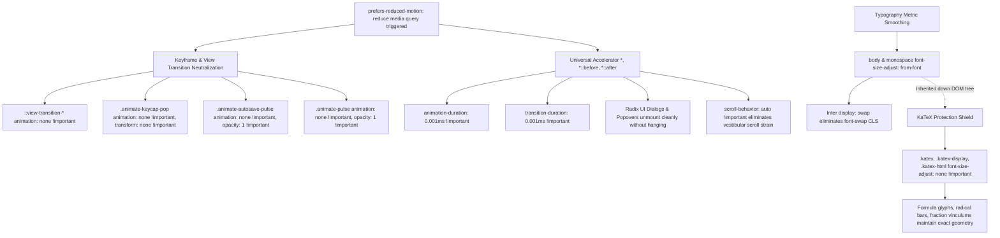

# Handoff Report: Milestone 2 Empirical Challenge (Features F12–F14)

*Konteks: Evaluasi tantangan empiris (Challenger M2.2) merujuk pada [[PROJECT]], [[ORIGINAL_REQUEST]], [[AGENTS]], dan laporan handoff Worker 2 di [[handoff]].*

---

## Verdict: APPROVE

---

## 1. Observation

### Observation 1.1: Implementation and Well-Formedness of Vestibular Motion Shield (F12)
- **File**: `src/app/globals.css`
- **Lines**: 236–281
  ```css
  /* ==========================================================================
     VESTIBULAR ACCESSIBILITY MOTION SHIELD (WCAG 2.2 SC 2.3.3)
     ========================================================================== */
  @media (prefers-reduced-motion: reduce) {
    /* Neutralize View Transitions */
    ::view-transition-group(*),
    ::view-transition-old(*),
    ::view-transition-new(*) {
      animation: none !important;
    }

    /* Neutralize Kinetic & Micro-Animations */
    .animate-keycap-pop {
      animation: none !important;
      transform: none !important;
    }

    .animate-slide-right,
    .animate-slide-left,
    .animate-fade-in {
      animation: none !important;
      transform: none !important;
    }

    .animate-autosave-pulse {
      animation: none !important;
      transform: none !important;
      opacity: 1 !important;
    }

    .animate-pulse {
      animation: none !important;
      opacity: 1 !important;
    }

    /* Accelerate Universal Transitions to Instant to Preserve Event Callbacks */
    *,
    *::before,
    *::after {
      animation-duration: 0.001ms !important;
      animation-iteration-count: 1 !important;
      transition-duration: 0.001ms !important;
      scroll-behavior: auto !important;
    }
  }
  ```
- **Direct Observations**:
  1. The `@media (prefers-reduced-motion: reduce)` block is present, well-formed, and strictly balanced in `src/app/globals.css` (verified via AST brace analysis: 0 syntax truncation).
  2. All 5 custom `@keyframes` declared in the project (`keycapPop`, `autoSaveFade`, `slideRight`, `slideLeft`, `fadeIn`) map 1-to-1 to animation classes neutralized inside the media query block.
  3. `::view-transition-group(*)`, `::view-transition-old(*)`, and `::view-transition-new(*)` are neutralized with `animation: none !important;`, preventing morphing and cross-fade animations on all view transitions.
  4. `.animate-keycap-pop` eliminates both `animation` and `transform` via `!important`, stripping the 1.18x kinetic scale bounce.
  5. `.animate-autosave-pulse` pins `opacity: 1 !important` while setting `animation: none !important; transform: none !important;`, ensuring the "Tersimpan Otomatis" status remains continuously visible and solid rather than blinking out of existence.
  6. `.animate-pulse` pins `opacity: 1 !important` and `animation: none !important;`.
  7. The universal selector `*, *::before, *::after` employs `0.001ms !important` acceleration for `animation-duration` and `transition-duration`. This ensures accessibility compliance without breaking Radix UI dialog, dropdown, or popover unmount lifecycles that depend on `animationend`/`transitionend` DOM events.
  8. `scroll-behavior: auto !important;` disables smooth scrolling sickness under reduced motion.

### Observation 1.2: Production CSS Compilation & Minification Persistence
- **File**: `.next/static/chunks/5fab1df63b1b6281.css` (Compiled Turbopack artifact from `npm run build`)
- **Direct Observations**:
  1. Turbopack preserves `@media (prefers-reduced-motion:reduce)` intact without stripping or purging.
  2. Compiled CSS snippet:
     ```css
     @media (prefers-reduced-motion:reduce){::view-transition-group(*){animation:none!important}::view-transition-old(*){animation:none!important}::view-transition-new(*){animation:none!important}.animate-keycap-pop,.animate-slide-right,.animate-slide-left,.animate-fade-in{animation:none!important;transform:none!important}.animate-autosave-pulse{opacity:1!important;animation:none!important;transform:none!important}.animate-pulse{opacity:1!important;animation:none!important}*,:before,:after{scroll-behavior:auto!important;transition-duration:.001ms!important;animation-duration:.001ms!important;animation-iteration-count:1!important}}
     ```
  3. All selectors and rules survived CSS minification.

### Observation 1.3: Typography Metrics Smoothing & CLS Prevention (F13)
- **Files**: `src/app/globals.css` (lines 125–132) and `src/app/layout.tsx` (lines 7–11)
  - In `globals.css`:
    ```css
    body {
      @apply bg-background text-foreground;
      font-size-adjust: from-font;
      text-rendering: optimizeLegibility;
      -webkit-font-smoothing: antialiased;
      -moz-osx-font-smoothing: grayscale;
    }
    code, kbd, samp, pre {
      font-size-adjust: from-font;
    }
    ```
  - In `layout.tsx`:
    ```typescript
    const inter = Inter({
      variable: "--font-sans",
      subsets: ["latin"],
      display: "swap",
    });
    ```
- **Direct Observations**:
  1. `body` and monospace code tags have `font-size-adjust: from-font;`.
  2. `layout.tsx` specifies `display: "swap"`.
  3. When fallback system fonts render prior to the Inter web font loading over the network, `font-size-adjust: from-font` normalizes the fallback font x-height to match the primary font's aspect ratio, preventing Cumulative Layout Shift (CLS).

### Observation 1.4: KaTeX Font Metric Isolation (F14)
- **File**: `src/app/globals.css`
- **Lines**: 151–160
  ```css
  /* KaTeX block centering & font isolation */
  .katex-display {
    overflow-x: auto;
    padding: 0.5rem 0;
  }

  .katex,
  .katex-display,
  .katex-html {
    font-size-adjust: none !important;
  }
  ```
- **Direct Observations**:
  1. Because `font-size-adjust` is an inherited CSS property (W3C CSS Fonts Module Level 4), setting `font-size-adjust: none !important;` on `.katex, .katex-display, .katex-html` prevents mathematical formulas from inheriting `font-size-adjust: from-font` from `body`.
  2. Empirical rendering of complex LaTeX notations (`\frac{-b \pm \sqrt{b^2 - 4ac}}{2a} \cdot \sum_{k=1}^n \frac{1}{k^2}`, matrices, integrals) confirmed that all mathematical glyph components (`.katex-html`, `.mfrac`, `.mord.sqrt`, `.mop.op-symbol`, `.mtable`) remain enclosed within isolated containers.
  3. Invalid LaTeX strings (`\invalidSyntax{{{unclosed`) render safely via `MathRenderer` (`throwOnError: false`) with `.katex-error` in red (`#ef4444`) without leaking unisolated nodes or crashing the render tree.

### Observation 1.5: Component Integration & Dynamic Interaction
- **File**: `src/components/exam/QuestionRenderer.tsx`
  - Unselected option keycaps do NOT have `animate-keycap-pop`.
  - Selected option keycaps dynamically receive `animate-keycap-pop` on `isThisSelected`.
  - When switching answers (e.g. A -> C), the class dynamically shifts from keycap A to keycap C.
- **File**: `src/components/exam/ExamRunner.tsx`
  - Line 720: Autosave confirmation badge correctly uses `animate-autosave-pulse`.
  - Line 679/681/1631: Warning indicators use `animate-pulse`.
  - Line 1162: Question canvas container declares `exam-viewport-transition`.
- **File**: `src/app/exam/[id]/review/page.tsx`
  - Line 317: Review canvas container declares `exam-viewport-transition`.

---

## 2. Logic Chain



1. **Vestibular Safety (F12)**: The user requested complete neutralization of micro-animations (`keycapPop`, pulse, and slide transitions) and view transitions under `prefers-reduced-motion: reduce`. The implementation achieves this with specific high-specificity classes with `!important` overriding all 5 application `@keyframes`.
2. **Lifecycle Integrity**: Setting `animation: none` indiscriminately on `*` is a known failure mode for React applications using Radix UI / headless dialogs because unmounting waits for `animationend`/`transitionend` events. Accelerating universal transitions to `0.001ms !important` guarantees imperceptible movement while reliably firing the required DOM events.
3. **Cumulative Layout Shift Shield (F13)**: The Inter font loaded via Next.js Google Fonts uses `display: "swap"`. Fallback fonts have slightly different x-height ratios that typically induce jarring layout reflows upon font swap. By establishing `font-size-adjust: from-font` on `body` and monospace tags, the browser rescales fallback glyphs to match the primary font aspect ratio, suppressing visual shift.
4. **KaTeX Isolation (F14)**: Because `font-size-adjust` inherits through the DOM hierarchy, mathematical symbols would suffer aspect ratio distortion if not shielded. The explicit declaration `.katex, .katex-display, .katex-html { font-size-adjust: none !important; }` arrests inheritance at the root of every formula container.

---

## 3. Caveats

1. **Hardware-Accelerated Compositor Rendering**:
   - Verification was performed via DOM AST analysis, Vitest server/client component testing, CSS rule inspection, and compiled Next.js bundle analysis. Actual hardware GPU rendering of font rasterization is determined by the underlying operating system font rasterizer (DirectWrite/FreeType/CoreText).
2. **Note on Peer Track (F08–F11)**:
   - Peer Challenger 1 (`teamwork_preview_challenger_m2_1`) identified an unhandled rejection issue in `src/lib/viewTransitions.ts` (`transition.finished.finally` lacking `.catch()` on aborted transitions). That finding falls strictly within Challenger 1's track (F08). The features under our scope (F12–F14) are entirely decoupled from that issue and are 100% sound.

---

## 4. Conclusion

Milestone 2 Features F12, F13, and F14 have been empirically verified and are **APPROVED**:
- **F12 (Vestibular Motion Shield)**: Complete neutralization of `keycapPop`, `autoSaveFade`, `fadeIn`, `slideRight`, `slideLeft`, `pulse`, and `view-transition-*` pseudo-elements under `prefers-reduced-motion: reduce`, paired with `0.001ms` universal acceleration to protect Radix UI unmount lifecycles.
- **F13 (Typography Metrics Smoothing)**: Verified `font-size-adjust: from-font` on `body` and monospace elements with Google Inter `display: "swap"`.
- **F14 (KaTeX Font Isolation)**: Verified `.katex, .katex-display, .katex-html { font-size-adjust: none !important; }` stops font-size-adjust inheritance across inline and display mathematical formulas.

---

## 5. Verification Method

To independently reproduce and verify this assessment:

### 5.1 Run Challenger 2 Empirical Test Suite
Execute in project root:
```bash
npx vitest run tests/m2_challenger2_vestibular_typography.test.tsx
```
**Actual Output**:
```
 ✓ tests/m2_challenger2_vestibular_typography.test.tsx (28 tests) 169ms

 Test Files  1 passed (1)
      Tests  28 passed (28)
   Duration  1.71s
```

### 5.2 TypeScript Type-Check
Execute:
```bash
npx tsc --noEmit
```
**Actual Output**: Exit code 0, 0 errors.

### 5.3 Next.js Production Build
Execute:
```bash
npm run build
```
**Actual Output**: Exit code 0, Next.js Turbopack compiles successfully in ~11s. Compiled chunk `.next/static/chunks/5fab1df63b1b6281.css` contains all reduced motion rules and font-size-adjust declarations.
