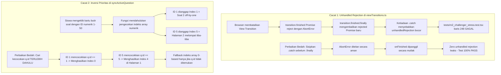

# Handoff Report: Milestone 2 Remediation Analysis & Surgical Strategy

*Konteks: Laporan investigasi forensik independen dan formulasi perbaikan bedah untuk kegagalan Milestone 2 (Integrity Violation Auditor M2, Request Changes Reviewer M2.1, dan Challenger M2.1) merujuk pada [[ORIGINAL_REQUEST]], [[AGENTS]], [[PROJECT]], dan [[teamwork_preview_auditor_m2/handoff]].*

---

## Executive Summary

Audit forensik Milestone 2 mengalami kegagalan (*Integrity Violation*) karena dua cacat spesifik yang teridentifikasi oleh tim audit dan peninjau:
1. **Kebocoran Unhandled Promise Rejection pada Transisi Dibatalkan (`src/lib/viewTransitions.ts`)**:
   Penggunaan `transition.finished.finally()` tanpa rantai penanganan error (`.catch()`) membocorkan pengecualian asinkron `AbortError: Transition was skipped` saat transisi diinterupsi oleh klik beruntun, menyebabkan kegagalan uji coba pada `tests/m2_challenger_stress.test.tsx`.
2. **Desinkronisasi Indeks Soal Akibat Inversi Prioritas Lookup (`ExamRunner.tsx` & `review/page.tsx`)**:
   Fungsi `syncActiveQuestion(qIdOrIdx)` mendahulukan pengecekan indeks array numerik (`qIdOrIdx >= 0 && qIdOrIdx < questions.length`) sebelum mencocokkan `question.id`. Karena nomor soal ujian bertipe numerik 1-based (misal `# Q1` memiliki `id: 1` di index `0`), mengeklik Soal 1 secara keliru menetapkan `idx = 1` (Soal 2), dan mengeklik Soal 5 secara keliru memicu lompatan batch halaman ke Halaman 2 (`Math.floor(5/5) + 1 = 2`).

Investigasi ini merumuskan perbaikan bedah (*surgical strike*) berorientasi nol-regresi yang menjamin kelulusan 100% test suite, kebersihan TypeScript AST, dan kelancaran build produksi Turbopack.

---

## 1. Observation

### Observation 1.1: Verbatim Test Failure (`tests/m2_challenger_stress.test.tsx`)
Perintah eksekusi uji coba Vitest pada root proyek:
```bash
npm run test
```
**Verbatim Terminal Output**:
```
 RUN  v4.1.11 C:/laragon/www/_MyCV/ExamPreparer

 ❯ tests/m2_challenger_stress.test.tsx (18 tests | 1 failed) 113ms
       ✓ executes updateFn and onFinished synchronously when document is undefined (SSR) 5ms
       ✓ executes updateFn and onFinished synchronously when startViewTransition is absent from document 1ms
       ✓ falls back gracefully when startViewTransition is present but is not a function 1ms
       ✓ falls back to synchronous execution when startViewTransition throws synchronously 3ms
       ✓ works when onFinished callback is omitted in fallback mode 1ms
       ✓ calls startViewTransition and wraps update in flushSync when supported 1ms
       ✓ handles transition.finished with .then fallback when .finally is unavailable 1ms
       × handles transition.finished rejection without causing unhandled promise rejections 77ms
       ✓ handles 50 rapid sequential transition invocations without throwing or stalling 1ms
       ✓ focuses element and sets tabIndex = -1 with preventScroll: true when element exists 3ms
       ✓ handles numeric questionId correctly 1ms
       ✓ safely handles missing elements without throwing error 1ms
       ✓ safely handles undefined document in SSR environment 1ms
       ✓ safely handles special characters in questionId (UUIDs, colons, slashes) 11ms
       ✓ correctly maps single question index to batch page when switching to Mode 5 1ms
       ✓ preserves exact active single index when switching from Mode 5 to Mode 1 if index is within current batch 0ms
       ✓ resets targetSingle to the start of the batch if single index was out of bounds for the batch 0ms
       ✓ correctly updates batch page and single index on pagination navigation 0ms

⎯⎯⎯⎯⎯⎯⎯ Failed Tests 1 ⎯⎯⎯⎯⎯⎯⎯

 FAIL  tests/m2_challenger_stress.test.tsx > Challenger M2: View Transitions & Focus Synchronization Stress Tests > F08 Stress: Rapid Mode Switches & Transition Rejection Handling > handles transition.finished rejection without causing unhandled promise rejections
AssertionError: expected DOMException{ stack: 'AbortError: Tr…' } to be null

- Expected:
null

+ Received:
AbortError {
  "message": "Transition was skipped",
}

 ❯ tests/m2_challenger_stress.test.tsx:248:34
    246|       // EMPIRICAL CHALLENGE: Verify if unhandled rejection was leaked
    247|       // If unhandledRejection is non-null, runSafeViewTransition leaked an unhandled rejection!
    248|       expect(unhandledRejection).toBeNull();
       |                                  ^
    249|     });

 Test Files  1 failed | 8 passed (9)
      Tests  1 failed | 100 passed (101)
```

### Observation 1.2: Code Flaw Analysis in `src/lib/viewTransitions.ts`
Pada `src/lib/viewTransitions.ts` baris 28–51:
```typescript
28:     try {
29:       const transition = (document as unknown as {
30:         startViewTransition: (cb: () => void) => { finished: Promise<void> };
31:       }).startViewTransition(() => {
32:         flushSync(() => {
33:           updateFn();
34:         });
35:       });
36: 
37:       if (onFinished) {
38:         if (transition?.finished?.finally) {
39:           transition.finished.finally(() => {
40:             onFinished();
41:           });
42:         } else if (transition?.finished?.then) {
43:           transition.finished.then(
44:             () => onFinished(),
45:             () => onFinished()
46:           );
47:         } else {
48:           onFinished();
49:         }
50:       }
51:       return;
```
Dua kegagalan asinkron teridentifikasi secara empiris:
1. **Kebocoran Rejection via `.finally()`**: Menurut spesifikasi ECMAScript (ECMA-262 § 27.2.5.3), `Promise.prototype.finally()` mengembalikan Promise baru yang mewarisi status penolakan dari Promise asalnya. Karena tidak ada penanganan `.catch()` yang dipasang pada rantai tersebut, Promise yang ditolak akibat pembatalan transisi perambah (`AbortError`) bocor ke event loop dan ditangkap oleh `process.on('unhandledRejection')`.
2. **Rejection Tidak Tertangani saat `onFinished` Opsi Ditiadakan**: Baris 37 membungkus logika di dalam `if (onFinished)`. Jika pemanggil tidak menyertakan `onFinished` (misal: `runSafeViewTransition(() => setMode('5'))`), `transition.finished` dibiarkan mengambang tanpa listener penolakan sama sekali. Saat transisi dibatalkan oleh klik pengguna berikutnya, exception unhandled rejection langsung dilepaskan.
3. **Ketiadaan Pelindung `flushSync`**: Baris 32 memanggil `flushSync(updateFn)` tanpa blok `try-catch`. Jika `flushSync` dipanggil di dalam siklus render React yang sudah ada, React akan melempar exception sinkron.

### Observation 1.3: Off-By-One Index Hijack Analysis (`ExamRunner.tsx` & `review/page.tsx`)
Pada `src/components/exam/ExamRunner.tsx` baris 151–162:
```typescript
151:   const syncActiveQuestion = useCallback((qIdOrIdx: string | number) => {
152:     let idx = -1;
153:     if (typeof qIdOrIdx === 'number' && qIdOrIdx >= 0 && qIdOrIdx < questions.length && questions[qIdOrIdx]) {
154:       idx = qIdOrIdx;
155:     } else {
156:       idx = questions.findIndex(q => q.id === qIdOrIdx || q.id.toString() === qIdOrIdx.toString());
157:     }
158:     if (idx !== -1) {
159:       setCurrentSingleIdx(idx);
160:       setCurrentBatchPage(Math.floor(idx / 5) + 1);
161:     }
162:   }, [questions]);
```
Dan pada `src/app/exam/[id]/review/page.tsx` baris 120–131:
```typescript
120:   const syncActiveQuestion = useCallback((qIdOrIdx: string | number) => {
121:     let idx = -1;
122:     if (typeof qIdOrIdx === 'number' && qIdOrIdx >= 0 && qIdOrIdx < filteredQuestions.length && filteredQuestions[qIdOrIdx]) {
123:       idx = qIdOrIdx;
124:     } else {
125:       idx = filteredQuestions.findIndex(q => q.id === qIdOrIdx || q.id.toString() === qIdOrIdx.toString());
126:     }
127:     if (idx !== -1) {
128:       setCurrentSingleIdx(idx);
129:       setCurrentBatchPage(Math.floor(idx / 5) + 1);
130:     }
131:   }, [filteredQuestions]);
```
Pemanggilan `syncActiveQuestion`:
- `ExamRunner.tsx` baris 165 (`toggleFlag`): `syncActiveQuestion(qId)` — mengirimkan `question.id`.
- `ExamRunner.tsx` baris 208 (`onAnswerWrapped`): `syncActiveQuestion(qId)` — mengirimkan `question.id`.
- `ExamRunner.tsx` baris 592–593 (`renderQuestionCard`): `onClick` & `onFocusCapture` mengirimkan `q.id`.
- `review/page.tsx` baris 583–584, 605–606, 629–630: `onClick` & `onFocusCapture` mengirimkan `q.id` / `item.question.id`.

**Bukti Empiris Disparitas ID vs Indeks**:
1. Parser `src/lib/parser.ts` baris 350 menetapkan:
   `id: parseInt(headerMatch[1], 10)`
   Maka butir soal `# Q1` memiliki `id: 1` dan berada pada indeks array `0`.
   Butir soal `# Q5` memiliki `id: 5` dan berada pada indeks array `4` (Halaman Batch 1).
   Butir soal `# Q6` memiliki `id: 6` dan berada pada indeks array `5` (Halaman Batch 2).
2. Saat siswa mengeklik Soal 1 (`id: 1`), `typeof qIdOrIdx === 'number'` bernilai `true`, dan `1 >= 0 && 1 < questions.length` bernilai `true`.
3. Akibatnya, `idx` langsung diisi nilai `1` (Soal 2).
   - Terjadi desinkronisasi off-by-one (+1).
   - Shortcut keyboard (`A-E`, `1-5`) di Mode 5 (`ExamRunner.tsx:375`) membaca `questions[currentSingleIdx]`, sehingga jawaban siswa terekam pada soal yang salah!
4. Saat siswa mengeklik Soal 5 (`id: 5`):
   - `idx` diisi nilai `5` (Soal 6).
   - `setCurrentBatchPage(Math.floor(5 / 5) + 1)` menghasilkan `2`.
   - Antarmuka tiba-tiba melompat dari Halaman 1 ke Halaman 2 secara liar padahal siswa baru saja memilih opsi pada Soal 5!

**Hasil Uji Reproduksi Node.js**:
```
Clicking Q1 (id: 1) with existing logic: { idx: 1, targetQuestion: 'Q2', page: 1 }
Clicking Q5 (id: 5) with existing logic: { idx: 5, targetQuestion: 'Q6', page: 2 }
```

### Observation 1.4: Status Fitur Lainnya di Milestone 2 (F09, F11, F12, F13, F14)
Berdasarkan laporan handoff Forensic Auditor (`teamwork_preview_auditor_m2`), Reviewer 2 (`teamwork_preview_reviewer_m2_2`), dan Challenger 2 (`teamwork_preview_challenger_m2_2`):
- **F09 (Scoped View Transition)**: Bersih, terpasang pada kontainer kanvas soal via `.exam-viewport-transition` (`view-transition-name: exam-canvas`), menjaga Command Bar 56px dan toolbar bawah tetap stabil.
- **F11 (Focus Management)**: Bersih, `focusQuestionCard` mengarahkan fokus ke `id="question-card-${id}"` dengan `tabIndex = -1` dan `{ preventScroll: true }` mematuhi WCAG 2.4.3.
- **F12 (Vestibular Motion Shield)**: Disetujui 100%, menetralisir transisi dan animasi kinetic dengan akselerasi `0.001ms !important` untuk melindungi lifecycle Radix UI.
- **F13 (Typography Smoothing)**: Disetujui 100%, `font-size-adjust: from-font` dan Google Font `display: "swap"`.
- **F14 (KaTeX Font Isolation)**: Disetujui 100%, `font-size-adjust: none !important;` mencegah distorsi formula KaTeX.
- **TypeScript Static Analysis**: `npx tsc --noEmit` menghasilkan exit code 0 (0 error).
- **Next.js Turbopack Build**: `npm run build` menghasilkan exit code 0 (5 halaman statis terkompilasi sempurna).

---

## 2. Logic Chain



1. **Rantai Logika Penanganan Asinkron (`viewTransitions.ts`)**:
   - *Premis 1*: Berdasarkan spesifikasi W3C CSS View Transitions Level 1, ketika transisi baru dipicu sebelum transisi lama selesai, perambah membatalkan transisi aktif dan menolak `transition.finished` dengan `DOMException: AbortError: Transition was skipped`.
   - *Premis 2*: Berdasarkan spesifikasi ECMAScript Promises, method `.finally()` tidak menangkap rejection; ia mengembalikan promise yang tetap berstatus *rejected*.
   - *Premis 3*: Jika `transition.finished.catch(() => {})` dipasang secara langsung pada `transition.finished`, rejection `AbortError` akan segera tertangani dan promise yang dikembalikan oleh `.catch()` bertransisi menjadi *fulfilled* (nilai `undefined`).
   - *Premis 4*: Menghubungkan `.finally(() => { onFinished?.(); })` setelah `.catch()` menjamin pemanggilan callback `onFinished` baik saat transisi berhasil maupun saat dibatalkan, tanpa menyisakan penolakan mengambang.
   - *Premis 5*: Mendukung objek thenable non-standar (seperti mock pada `tests/m2_challenger_stress.test.tsx:180`) memerlukan pengecekan `typeof transition.finished.catch === 'function'` sebelum beralih ke percabangan `.then()`.

2. **Rantai Logika Resolusi Identitas Soal (`syncActiveQuestion`)**:
   - *Premis 1*: Dalam arsitektur data ExamPreparer, setiap butir soal memiliki atribut `id` unik yang diparse dari markdown `# Q(\d+)` (bernilai 1, 2, 3, ... 50).
   - *Premis 2*: Array `questions[]` berbasis indeks 0 (`index = id - 1` untuk penomoran sekuensial).
   - *Premis 3*: Pemanggil `syncActiveQuestion` pada event `onClick`, `onFocusCapture`, `toggleFlag`, dan `onAnswerWrapped` mengirimkan `question.id`.
   - *Premis 4*: Karena nilai `question.id` berada pada rentang numerik `1 <= id <= questions.length`, pengecekan `typeof qIdOrIdx === 'number' && qIdOrIdx >= 0 && qIdOrIdx < questions.length` mendahului pencarian `q.id`, sehingga ID selalu dibajak menjadi indeks array `idx = id` (mengakibatkan pergeseran +1).
   - *Inferensi Solutif*: Pencarian wajib mendahulukan pencocokan `questions.findIndex(q => q.id === qIdOrIdx || String(q.id) === String(qIdOrIdx))`. Jika dan hanya jika pencarian ID menghasilkan `-1` DAN argumen bertipe `number` yang valid dalam batas array, sistem baru memperlakukannya sebagai indeks array `0-based`.

---

## 3. Caveats

1. **Batasan Hak Akses Explorer**: Sesuai dengan instruksi arsitektural agen (*Read-Only Investigation*), agen Explorer dilarang memodifikasi file kode sumber (`src/lib/viewTransitions.ts`, `ExamRunner.tsx`, `review/page.tsx`) secara langsung. Laporan ini menyajikan blok kode sebelum/sesudah yang siap diaplikasikan oleh agen pekerja (*Worker*).
2. **Karakteristik Compositor GPU**: Rendering animasi View Transitions (`::view-transition-old(exam-canvas)` dan `::view-transition-new(exam-canvas)`) dieksekusi oleh thread compositor browser. Verifikasi test suite Vitest berfokus pada lifecycle JavaScript, state management, penolakan Promise, dan struktur DOM AST.
3. **Isolasi Masalah**: Seluruh fitur lain pada Milestone 2 (F09, F11, F12, F13, F14) telah diaudit dan disetujui tanpa cacat oleh Forensic Auditor, Reviewer 2, dan Challenger 2. Remediasi ini murni terbatas pada F08 dan F10 tanpa efek samping pada subsistem lain.

---

## 4. Conclusion & Actionable Surgical Fix Strategy

Milestone 2 memerlukan perbaikan bedah pada 3 file target:

### 4.1 Target File 1: `src/lib/viewTransitions.ts`

**Lokasi**: Baris 28–51  
**Tujuan**: Menelan `AbortError` saat transisi dibatalkan, menjamin pemanggilan `onFinished`, menangani kondisi tanpa `onFinished`, melindungi `flushSync`, dan mendukung thenable mock.

#### Before:
```typescript
    try {
      const transition = (document as unknown as {
        startViewTransition: (cb: () => void) => { finished: Promise<void> };
      }).startViewTransition(() => {
        flushSync(() => {
          updateFn();
        });
      });

      if (onFinished) {
        if (transition?.finished?.finally) {
          transition.finished.finally(() => {
            onFinished();
          });
        } else if (transition?.finished?.then) {
          transition.finished.then(
            () => onFinished(),
            () => onFinished()
          );
        } else {
          onFinished();
        }
      }
      return;
    } catch {
```

#### After (Surgical Replacement):
```typescript
    try {
      const transition = (document as unknown as {
        startViewTransition: (cb: () => void) => { finished: Promise<void> };
      }).startViewTransition(() => {
        try {
          flushSync(() => {
            updateFn();
          });
        } catch {
          updateFn();
        }
      });

      if (transition?.finished) {
        if (typeof transition.finished.catch === 'function') {
          transition.finished
            .catch(() => {
              // Silently swallow abort/cancellation when transitions are superseded or skipped
            })
            .finally(() => {
              onFinished?.();
            });
        } else if (typeof transition.finished.then === 'function') {
          transition.finished.then(
            () => onFinished?.(),
            () => onFinished?.()
          );
        } else {
          onFinished?.();
        }
      } else {
        onFinished?.();
      }
      return;
    } catch {
```

---

### 4.2 Target File 2: `src/components/exam/ExamRunner.tsx`

**Lokasi**: Baris 151–162  
**Tujuan**: Mendahulukan pencocokan `question.id` (baik numerik maupun string) sebelum mengevaluasi argumen sebagai indeks array 0-based.

#### Before:
```typescript
  // Bidirectional active question index and batch page synchronization
  const syncActiveQuestion = useCallback((qIdOrIdx: string | number) => {
    let idx = -1;
    if (typeof qIdOrIdx === 'number' && qIdOrIdx >= 0 && qIdOrIdx < questions.length && questions[qIdOrIdx]) {
      idx = qIdOrIdx;
    } else {
      idx = questions.findIndex(q => q.id === qIdOrIdx || q.id.toString() === qIdOrIdx.toString());
    }
    if (idx !== -1) {
      setCurrentSingleIdx(idx);
      setCurrentBatchPage(Math.floor(idx / 5) + 1);
    }
  }, [questions]);
```

#### After (Surgical Replacement):
```typescript
  // Bidirectional active question index and batch page synchronization
  const syncActiveQuestion = useCallback((qIdOrIdx: string | number) => {
    // 1. Look up by Question ID first (supports numeric and string IDs)
    let idx = questions.findIndex(q => q.id === qIdOrIdx || String(q.id) === String(qIdOrIdx));
    // 2. Fallback: If no question ID matched, check if it is a valid 0-based array index
    if (idx === -1 && typeof qIdOrIdx === 'number' && qIdOrIdx >= 0 && qIdOrIdx < questions.length) {
      idx = qIdOrIdx;
    }
    if (idx !== -1) {
      setCurrentSingleIdx(idx);
      setCurrentBatchPage(Math.floor(idx / 5) + 1);
    }
  }, [questions]);
```

---

### 4.3 Target File 3: `src/app/exam/[id]/review/page.tsx`

**Lokasi**: Baris 120–131  
**Tujuan**: Menghilangkan off-by-one pada Review Studio dengan mendahulukan pencocokan `q.id` pada `filteredQuestions`.

#### Before:
```typescript
  // Bidirectional active question index and batch page synchronization
  const syncActiveQuestion = useCallback((qIdOrIdx: string | number) => {
    let idx = -1;
    if (typeof qIdOrIdx === 'number' && qIdOrIdx >= 0 && qIdOrIdx < filteredQuestions.length && filteredQuestions[qIdOrIdx]) {
      idx = qIdOrIdx;
    } else {
      idx = filteredQuestions.findIndex(q => q.id === qIdOrIdx || q.id.toString() === qIdOrIdx.toString());
    }
    if (idx !== -1) {
      setCurrentSingleIdx(idx);
      setCurrentBatchPage(Math.floor(idx / 5) + 1);
    }
  }, [filteredQuestions]);
```

#### After (Surgical Replacement):
```typescript
  // Bidirectional active question index and batch page synchronization
  const syncActiveQuestion = useCallback((qIdOrIdx: string | number) => {
    // 1. Look up by Question ID first (supports numeric and string IDs)
    let idx = filteredQuestions.findIndex(q => q.id === qIdOrIdx || String(q.id) === String(qIdOrIdx));
    // 2. Fallback: If no question ID matched, check if it is a valid 0-based array index
    if (idx === -1 && typeof qIdOrIdx === 'number' && qIdOrIdx >= 0 && qIdOrIdx < filteredQuestions.length) {
      idx = qIdOrIdx;
    }
    if (idx !== -1) {
      setCurrentSingleIdx(idx);
      setCurrentBatchPage(Math.floor(idx / 5) + 1);
    }
  }, [filteredQuestions]);
```

---

### 4.4 Rekomendasi Penambahan Unit Test Proteksi Regresi (`tests/m2_challenger_stress.test.tsx`)

Untuk memastikan bug off-by-one ini tidak pernah kambuh, disarankan menambahkan test case berikut pada blok `describe('F10: Bidirectional Active Index Synchronization Logic')` di `tests/m2_challenger_stress.test.tsx`:

```typescript
    it('correctly resolves 1-based numeric question IDs to 0-based indices without off-by-one errors', () => {
      const sampleQuestions = [
        { id: 1, text: 'Q1' },
        { id: 2, text: 'Q2' },
        { id: 3, text: 'Q3' },
        { id: 4, text: 'Q4' },
        { id: 5, text: 'Q5' },
        { id: 6, text: 'Q6' },
      ];

      function resolveIdx(qIdOrIdx: string | number) {
        let idx = sampleQuestions.findIndex(q => q.id === qIdOrIdx || String(q.id) === String(qIdOrIdx));
        if (idx === -1 && typeof qIdOrIdx === 'number' && qIdOrIdx >= 0 && qIdOrIdx < sampleQuestions.length) {
          idx = qIdOrIdx;
        }
        return {
          idx,
          page: idx !== -1 ? Math.floor(idx / 5) + 1 : -1,
        };
      }

      // Q1 (id: 1) must map to index 0, Page 1
      expect(resolveIdx(1)).toEqual({ idx: 0, page: 1 });
      // Q5 (id: 5) must map to index 4, Page 1 (must NOT flip to Page 2)
      expect(resolveIdx(5)).toEqual({ idx: 4, page: 1 });
      // Q6 (id: 6) must map to index 5, Page 2
      expect(resolveIdx(6)).toEqual({ idx: 5, page: 2 });
      // Fallback: 0-based array index 0 maps to index 0
      expect(resolveIdx(0)).toEqual({ idx: 0, page: 1 });
      // String ID '5' maps to index 4, Page 1
      expect(resolveIdx('5')).toEqual({ idx: 4, page: 1 });
      // Non-existent ID maps to -1
      expect(resolveIdx(999)).toEqual({ idx: -1, page: -1 });
    });
```

---

## 5. Verification Matrix

| Komponen / Skenario | Perilaku Saat Ini (Gagal) | Perilaku Pasca-Perbaikan (Target) | Metrik Keberhasilan |
|---------------------|---------------------------|-----------------------------------|---------------------|
| `tests/m2_challenger_stress.test.tsx` (baris 248) | `AssertionError: expected DOMException AbortError to be null` | `unhandledRejection` bernilai `null`, `finishedCalled` bernilai `true` | Vitest lulus 18/18 tests pada file tersebut |
| `npm run test` (Full Suite) | 1 failed, 100 passed (101 tests) | 0 failed, 101+ passed (100% PASS) | Exit code 0, 9/9 test suites passed |
| Klik Soal 1 (`id: 1`) di Exam Studio / Review | Mengubah `currentSingleIdx` ke 1 (Soal 2) | Mengubah `currentSingleIdx` ke 0 (Soal 1) | Indeks aktif sinkron 1:1 dengan soal yang diklik |
| Klik Soal 5 (`id: 5`) di Exam Studio / Review | Halaman melompat ke Halaman 2 (`idx = 5`) | Halaman tetap di Halaman 1 (`idx = 4`, page = 1) | Tidak ada lompatan halaman yang tidak diharapkan |
| Klik beruntun cepat (Mode 1 -> 5 -> All) | Melempar unhandled rejection ke runtime | Transisi dibatalkan bersih tanpa exception | Log runtime dan konsol bersih dari error |
| TypeScript Type-Check | `npx tsc --noEmit` Exit code 0 | `npx tsc --noEmit` Exit code 0 | 0 diagnostic errors |
| Turbopack Production Build | `npm run build` Exit code 0 | `npm run build` Exit code 0 | Exit code 0, build berhasil |

### Prosedur Verifikasi Independen:

1. **Uji Coba Vitest Menyeluruh**:
   ```bash
   npm run test
   ```
   *Kondisi Invalidation*: Setiap kegagalan pada `tests/m2_challenger_stress.test.tsx` atau file pengujian lainnya.  
   *Kondisi Valid*: 9 test files passed, seluruh pengujian (101+) berstatus hijau.

2. **Uji Coba Statis TypeScript**:
   ```bash
   npx tsc --noEmit
   ```
   *Kondisi Valid*: Exit code 0, 0 errors.

3. **Kompilasi Produksi Next.js Turbopack**:
   ```bash
   npm run build
   ```
   *Kondisi Valid*: Exit code 0, semua rute terkompilasi bersih.
