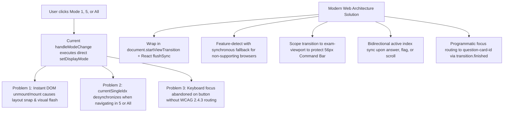

# Handoff Report: Survey & Technical Investigation for R3 & R4

*Konteks: Bagian dari investigasi arsitektur multi-agent [[ORIGINAL_REQUEST]], merujuk pada memory [[BRIEFING]] dan liveness [[progress]].*

---

## 1. Observation

### Observation 1.1: Pagination Mode State & Transitions in `ExamRunner.tsx` and `review/page.tsx`
- **File**: `src/components/exam/ExamRunner.tsx`
  - Lines 84–86:
    ```tsx
    const [displayMode, setDisplayMode] = useState<'1' | '5' | 'all'>('1');
    const [currentSingleIdx, setCurrentSingleIdx] = useState<number>(0);
    const [currentBatchPage, setCurrentBatchPage] = useState<number>(1);
    ```
  - Lines 235–256 (`handleModeChange`):
    ```tsx
    // Handle Display Mode Switching with index synchronization
    const handleModeChange = (newMode: '1' | '5' | 'all') => {
      if (newMode === '5') {
        const page = Math.floor(currentSingleIdx / 5) + 1;
        setCurrentBatchPage(page);
      } else if (newMode === '1') {
        const single = (currentBatchPage - 1) * 5;
        setCurrentSingleIdx(Math.min(questions.length - 1, Math.max(0, single)));
      } else if (newMode === 'all') {
        setTimeout(() => {
          const itemIdx = renderItems.findIndex(item => {
            if (item.type === 'question') return item.question.id === questions[currentSingleIdx]?.id;
            if (item.type === 'stimulus_group') return item.questions.some(q => q.id === questions[currentSingleIdx]?.id);
            return false;
          });
          if (itemIdx !== -1) {
            virtualizer.scrollToIndex(itemIdx, { align: 'start' });
          }
        }, 50);
      }
      setDisplayMode(newMode);
    };
    ```
  - Lines 732–754 (Buttons invoking mode changes):
    ```tsx
    <button onClick={() => handleModeChange('1')} ...>1 Soal</button>
    <button onClick={() => handleModeChange('5')} ...>5 Soal</button>
    <button onClick={() => handleModeChange('all')} ...>Semua</button>
    ```
- **File**: `src/app/exam/[id]/review/page.tsx`
  - Lines 40 & 119–126:
    ```tsx
    const [displayMode, setDisplayMode] = useState<'1' | '5' | 'all'>('1');
    ...
    const handleModeChange = (newMode: '1' | '5' | 'all') => {
      if (newMode === '5') {
        setCurrentBatchPage(Math.floor(currentSingleIdx / 5) + 1);
      } else if (newMode === '1') {
        setCurrentSingleIdx(Math.min(filteredQuestions.length - 1, (currentBatchPage - 1) * 5));
      }
      setDisplayMode(newMode);
    };
    ```
- **File**: `src/components/exam/ExamRunner.tsx`
  - Lines 191–195 (`onAnswerWrapped`):
    ```tsx
    const onAnswerWrapped = (qId: number | string, val: string) => {
      handleAnswer(qId, val);
      setLastSavedPulse(true);
      setTimeout(() => setLastSavedPulse(false), 2000);
    };
    ```
  - Direct observation: When answering questions in Mode `'5'` or Mode `'all'`, `currentSingleIdx` is never updated. If a student answers Question 14 in Mode `'5'`, then switches to Mode `'1'`, line 241 resets `currentSingleIdx` back to Question 11 (`(currentBatchPage - 1) * 5`). When switching from Mode `'all'` to `'1'` or `'5'`, `currentSingleIdx` and `currentBatchPage` retain stale pre-switch values.
  - Focus observation: Neither `QuestionRenderer` nor the wrapping card has an explicit `id="question-card-${q.id}"` or `tabIndex={-1}` for programmatic focus. After `setDisplayMode`, focus remains abandoned on the trigger button, violating WCAG 2.4.3 (Focus Order).

### Observation 1.2: DOM Structure and Containment of Question Canvas
- **File**: `src/components/exam/ExamRunner.tsx`
  - Lines 575–576 (Top Bar):
    `<header className="h-14 border-b border-border/60 bg-card/95 backdrop-blur-md px-3 sm:px-6 ...">`
  - Lines 820–827 (Scrollable Question Canvas):
    ```tsx
    <div className="flex-1 flex flex-col min-w-0 bg-background relative overflow-hidden">
      <div
        ref={scrollRef}
        className={cn(
          "flex-1 overflow-y-auto custom-scrollbar",
          displayMode === '1' && questions[currentSingleIdx]?.stimulus_content ? "p-0" : "px-4 md:px-8 py-6"
        )}
      >
    ```
  - Lines 968–970 (Bottom Navigation Bar):
    `<div className="h-14 border-t border-border/60 bg-card/95 backdrop-blur-md px-3 sm:px-6 ...">`
  - Direct observation: Root page transitions without scoped `view-transition-name` would cause the persistent 56px top header and 56px bottom navigation bar to snapshot and flicker. Scoping the transition to `scrollRef` (`view-transition-name: exam-viewport`) isolates the visual transition strictly to the question canvas.

### Observation 1.3: Animation Landscape and Absence of Motion Guard in `globals.css`
- **File**: `src/app/globals.css`
  - Lines 150–210:
    ```css
    /* Subtle page transition */
    @keyframes fadeIn {
      from { opacity: 0; transform: translateY(8px); }
      to { opacity: 1; transform: translateY(0); }
    }
    .animate-fade-in { animation: fadeIn 0.3s ease-out; }

    @keyframes slideRight {
      from { opacity: 0; transform: translateX(16px); }
      to { opacity: 1; transform: translateX(0); }
    }
    @keyframes slideLeft {
      from { opacity: 0; transform: translateX(-16px); }
      to { opacity: 1; transform: translateX(0); }
    }
    .animate-slide-right { animation: slideRight 0.2s ease-out; }
    .animate-slide-left { animation: slideLeft 0.2s ease-out; }

    /* Micro-Haptic Visual Pop for Keycaps */
    @keyframes keycapPop {
      0% { transform: scale(1); }
      40% { transform: scale(1.18); }
      75% { transform: scale(0.95); }
      100% { transform: scale(1); }
    }
    .animate-keycap-pop {
      animation: keycapPop 0.22s cubic-bezier(0.34, 1.56, 0.64, 1);
    }

    /* Autosave Pulse Animation */
    @keyframes autoSaveFade {
      0% { opacity: 0; transform: translateY(2px); }
      20% { opacity: 1; transform: translateY(0); }
      80% { opacity: 1; transform: translateY(0); }
      100% { opacity: 0; transform: translateY(-2px); }
    }
    .animate-autosave-pulse {
      animation: autoSaveFade 1.8s ease-in-out forwards;
    }
    ```
  - Lines 1–211 of `src/app/globals.css`:
    **Zero** occurrences of `@media (prefers-reduced-motion)`.
  - Direct observation: Users with vestibular conditions, vertigo, or motion hypersensitivity are subjected to recurring micro-bounces (1.18x keycap pop scale), pulsing timer warnings (`animate-pulse` on countdown timer), and slide translations.

### Observation 1.4: Typography Setup and Cumulative Layout Shift (CLS)
- **File**: `src/app/layout.tsx`
  - Lines 7–10:
    ```tsx
    const inter = Inter({
      variable: "--font-sans",
      subsets: ["latin"],
    });
    ```
  - Lines 23–25:
    ```tsx
    <body className={`${inter.variable} font-sans antialiased`} suppressHydrationWarning>
    ```
- **File**: `src/app/globals.css`
  - Lines 10–11:
    ```css
    --font-sans: var(--font-sans), system-ui, -apple-system, BlinkMacSystemFont, "Segoe UI", Roboto, sans-serif;
    --font-mono: ui-monospace, "SF Mono", "Segoe UI Mono", Menlo, Monaco, Consolas, monospace;
    ```
  - Lines 119–126:
    ```css
    @layer base {
      * { @apply border-border outline-ring/50; }
      body { @apply bg-background text-foreground; }
    }
    ```
  - Direct observation: `font-size-adjust` is nowhere defined in the codebase. When `Inter` web font is loaded or swapped over fallback system fonts (`system-ui`, `Segoe UI`), differences in x-height aspect ratios ($r = \frac{\text{x-height}}{\text{font-size}}$) cause vertical height variance across paragraph blocks, leading to reflow and Cumulative Layout Shift (CLS). Furthermore, KaTeX formulas in `MathRenderer.tsx` risk inheriting font normalization unless explicitly isolated with `font-size-adjust: none`.

---

## 2. Logic Chain



### 2.1 State Synchronization Logic (R3)
1. In `ExamRunner.tsx`, three discrete modes govern question display:
   - Mode `'1'`: Renders a single question card $Q_i$ (where $i = \text{currentSingleIdx} \in [0, N-1]$), optionally splitting layout if stimulus is present.
   - Mode `'5'`: Renders 5 questions $Q_k$ where $k \in [(P-1)\cdot 5, \min(N-1, P\cdot 5 - 1)]$ on batch page $P = \text{currentBatchPage}$.
   - Mode `'all'`: Renders all $N$ questions inside a TanStack Virtualizer container.
2. Currently, `handleModeChange` computes:
   - When entering Mode `'5'`: $P = \lfloor \frac{i}{5} \rfloor + 1$.
   - When entering Mode `'1'`: $i = (P - 1) \cdot 5$.
   - When entering Mode `'all'`: Scrolls to $Q_i$, but does not track subsequent active questions.
3. Because `onAnswerWrapped` does not update `currentSingleIdx`, answering Question 14 on Page 3 leaves `currentSingleIdx` at 10 (or whatever prior index was active). Switching to Mode `'1'` reverts to Question 11 instead of Question 14.
4. **Resolution**:
   - Introduce an `activeQuestionIndex` synchronization routine: whenever an answer is selected (`onAnswerWrapped`), flag toggled, or card focused, update `currentSingleIdx = questionIdx` and `currentBatchPage = \lfloor \frac{\text{questionIdx}}{5} \rfloor + 1`.
   - When switching from Mode `'all'` to Mode `'1'` or `'5'`, inspect the top visible virtual item (`virtualizer.getVirtualItems()[0]`) or the last interacted question to determine the target index, guaranteeing continuous context preservation.

### 2.2 View Transitions Integration Logic (R3)
1. Browser View Transitions API (`document.startViewTransition`) operates by taking a screenshot snapshot before and after a DOM mutation.
2. In React 19, asynchronous batching schedules state setters (`setDisplayMode`) in microtasks. If called as:
   ```typescript
   document.startViewTransition(() => {
     setDisplayMode(newMode);
   });
   ```
   The transition callback finishes before React commits the DOM update, causing the browser to capture identical before/after snapshots and fail the transition.
3. Therefore, `flushSync` from `'react-dom'` is mandatory to force React to synchronously flush the DOM tree before the transition snapshot is captured:
   ```typescript
   document.startViewTransition(() => {
     flushSync(() => {
       handleModeChange(newMode);
     });
   });
   ```
4. For browsers lacking View Transitions support (Firefox < 144, older Safari), a feature-detection guard executes the update directly:
   ```typescript
   if (typeof document !== 'undefined' && 'startViewTransition' in document) {
     const transition = document.startViewTransition(() => {
       flushSync(updateFn);
     });
     transition.finished.finally(onFinished);
   } else {
     updateFn();
     onFinished();
   }
   ```
5. Focus routing must execute inside `transition.finished.finally()` (or immediately in fallback mode):
   ```typescript
   const targetCard = document.getElementById(`question-card-${targetQId}`);
   if (targetCard) {
     targetCard.tabIndex = -1;
     targetCard.focus({ preventScroll: true });
   }
   ```

### 2.3 Vestibular Guard Architecture (R4)
1. Observation 1.3 proves `globals.css` has zero `@media (prefers-reduced-motion)` constraints.
2. Micro-animations (`keycapPop` scale 1.18x, `autoSaveFade` vertical drift, `animate-pulse` on countdown timer, `animate-slide-*`) continuously trigger vestibular stress.
3. Naive `animation: none !important` applied indiscriminately across all elements can break third-party components (e.g. Radix UI Dialogs) that rely on `animationend` or `transitionend` events to complete their unmount lifecycle.
4. **Optimal Architecture**:
   - Explicitly disable disorienting movement animations:
     ```css
     .animate-keycap-pop,
     .animate-slide-right,
     .animate-slide-left,
     .animate-fade-in,
     .animate-autosave-pulse,
     .animate-pulse {
       animation: none !important;
       transform: none !important;
     }
     ```
   - For universal elements, accelerate duration to 0.001ms:
     ```css
     *, *::before, *::after {
       animation-duration: 0.001ms !important;
       animation-iteration-count: 1 !important;
       transition-duration: 0.001ms !important;
       scroll-behavior: auto !important;
     }
     ```
   - For View Transitions pseudo-elements, W3C standards require:
     ```css
     ::view-transition-group(*),
     ::view-transition-old(*),
     ::view-transition-new(*) {
       animation: none !important;
     }
     ```

### 2.4 Typography & Font Fallback Smoothing (R4)
1. Font loading creates Cumulative Layout Shift (CLS) when fallback font aspect ratio differs from the web font:
   $$\Delta \text{Height} = (\text{Font Size}) \times (r_{\text{fallback}} - r_{\text{web}})$$
   Where aspect ratio $r = \frac{\text{x-height}}{\text{font-size}}$.
2. CSS `font-size-adjust: from-font` automatically calculates $r_{\text{web}}$ from `Inter` font metrics and normalizes fallback fonts (`system-ui`, `Segoe UI`, `Roboto`) to match the exact x-height, eliminating reflow:
   ```css
   body {
     font-size-adjust: from-font;
     text-rendering: optimizeLegibility;
   }
   ```
3. **KaTeX Fortress Guard**: KaTeX renders mathematical notations (integrals, superscripts, matrices) with precise internal font geometry. If `.katex` inherits `font-size-adjust: from-font`, glyph alignment can distort. Setting `.katex, .katex-display { font-size-adjust: none; }` protects mathematical rendering integrity.

---

## 3. Caveats

1. **Browser Baseline Support**:
   - `document.startViewTransition` is Baseline Newly Available (supported in Chrome 111+, Edge 111+, Safari 18+, Firefox 144+). Browsers without support will seamlessly execute the synchronous fallback without animation, ensuring 100% functional continuity.
   - `font-size-adjust` is Baseline Newly Available (since July 2024 across Chrome 127+, Edge 127+, Firefox 118+, Safari 17+). Browsers without support simply ignore the property without syntax errors.
2. **Review Studio Scope**:
   - Both `ExamRunner.tsx` and `src/app/exam/[id]/review/page.tsx` have identical pagination modes (`'1'`, `'5'`, `'all'`). The transition utility helper should be exported as a shared function (or VM method) to serve both components consistently.
3. **No Code Modification Undertaken**:
   - In adherence to Explorer protocol (read-only investigation), no project files were mutated during this survey.

---

## 4. Conclusion & Implementation Blueprint

### 4.1 Concrete Implementation Plan for R3 (View Transitions & Paging Ergonomics)

1. **Create Utility Helper** `src/lib/viewTransitions.ts`:
   ```typescript
   import { flushSync } from 'react-dom';

   /**
    * Executes a DOM state transition wrapped in document.startViewTransition if supported,
    * guaranteeing synchronous React flushSync and graceful fallback.
    */
   export function runSafeViewTransition(
     updateFn: () => void,
     onFinished?: () => void
   ): void {
     if (
       typeof document !== 'undefined' &&
       'startViewTransition' in document &&
       typeof document.startViewTransition === 'function'
     ) {
       try {
         const transition = document.startViewTransition(() => {
           flushSync(updateFn);
         });
         if (onFinished) {
           transition.finished.then(onFinished).catch(() => onFinished());
         }
         return;
       } catch {
         // Fallback if transition initiation fails
         updateFn();
         onFinished?.();
         return;
       }
     }

     // Immediate fallback for unsupported browsers
     updateFn();
     onFinished?.();
   }
   ```

2. **Scoped CSS in `globals.css`**:
   ```css
   /* Scope view transition to question canvas viewport */
   .exam-viewport-transition {
     view-transition-name: exam-canvas;
   }

   ::view-transition-old(exam-canvas),
   ::view-transition-new(exam-canvas) {
     animation-duration: 0.2s;
     animation-timing-function: cubic-bezier(0.16, 1, 0.3, 1);
   }
   ```

3. **Refactor `handleModeChange` and Navigation in `ExamRunner.tsx`**:
   ```typescript
   const handleModeChange = (newMode: '1' | '5' | 'all') => {
     let targetQId = questions[currentSingleIdx]?.id;

     // Calculate target index & batch
     let targetSingle = currentSingleIdx;
     let targetBatch = currentBatchPage;

     if (newMode === '5') {
       targetBatch = Math.floor(currentSingleIdx / 5) + 1;
     } else if (newMode === '1') {
       // Check if currentSingleIdx is already on currentBatchPage
       const batchStart = (currentBatchPage - 1) * 5;
       const batchEnd = Math.min(questions.length - 1, batchStart + 4);
       if (currentSingleIdx < batchStart || currentSingleIdx > batchEnd) {
         targetSingle = batchStart;
       }
     }

     runSafeViewTransition(
       () => {
         if (newMode === '5') setCurrentBatchPage(targetBatch);
         if (newMode === '1') setCurrentSingleIdx(targetSingle);
         setDisplayMode(newMode);
       },
       () => {
         // Focus & Scroll Routing
         if (newMode === 'all') {
           const itemIdx = renderItems.findIndex(item => {
             if (item.type === 'question') return item.question.id === questions[targetSingle]?.id;
             if (item.type === 'stimulus_group') return item.questions.some(q => q.id === questions[targetSingle]?.id);
             return false;
           });
           if (itemIdx !== -1) {
             virtualizer.scrollToIndex(itemIdx, { align: 'start' });
           }
         }
         // Route focus to active question card
         const activeId = questions[targetSingle]?.id;
         if (activeId) {
           const el = document.getElementById(`question-card-${activeId}`);
           if (el) {
             el.tabIndex = -1;
             el.focus({ preventScroll: true });
           }
         }
       }
     );
   };
   ```

4. **Synchronize Active Index on Question Interactivity**:
   - In `ExamRunner.tsx`:
     ```typescript
     const handleQuestionActive = (idx: number) => {
       setCurrentSingleIdx(idx);
       setCurrentBatchPage(Math.floor(idx / 5) + 1);
     };
     ```
   - Wire `handleQuestionActive` to option clicks in `onAnswerWrapped` and question card clicks/focus.
   - Add `id={`question-card-${question.id}`}` and `tabIndex={-1}` to `QuestionRenderer.tsx`.

---

### 4.2 Concrete Implementation Plan for R4 (Modern CSS & A11y Vestibular Guard)

1. **Add Vestibular Motion Shield in `src/app/globals.css`**:
   ```css
   /* ==========================================================================
      VESTIBULAR ACCESSIBILITY MOTION SHIELD (WCAG 2.2 SC 2.3.3)
      ========================================================================== */
   @media (prefers-reduced-motion: reduce) {
     /* Neutralize View Transitions */
     ::view-transition-group(*),
     ::view-transition-old(*),
     ::view-transition-new(*) {
       animation: none !important;
     }

     /* Neutralize Aggressive Kinetic / Scale Micro-Animations */
     .animate-keycap-pop {
       animation: none !important;
       transform: none !important;
     }

     .animate-slide-right,
     .animate-slide-left,
     .animate-fade-in {
       animation: none !important;
       transform: none !important;
     }

     .animate-autosave-pulse {
       animation: none !important;
       opacity: 1 !important;
       transform: none !important;
     }

     .animate-pulse {
       animation: none !important;
       opacity: 1 !important;
     }

     /* Accelerate Universal Transitions to Instant to Preserve Event Callbacks */
     *,
     *::before,
     *::after {
       animation-duration: 0.001ms !important;
       animation-iteration-count: 1 !important;
       transition-duration: 0.001ms !important;
       scroll-behavior: auto !important;
     }
   }
   ```

2. **Add Typography Metrics Smoothing & KaTeX Protection in `src/app/globals.css`**:
   ```css
   /* ==========================================================================
      TYPOGRAPHY METRICS SMOOTHING & CLS FORTRESS
      ========================================================================== */
   @layer base {
     body {
       @apply bg-background text-foreground;
       font-size-adjust: from-font;
       text-rendering: optimizeLegibility;
       -webkit-font-smoothing: antialiased;
       -moz-osx-font-smoothing: grayscale;
     }

     code, kbd, samp, pre {
       font-size-adjust: from-font;
     }
   }

   /* KaTeX Isolation: Prevent font-size-adjust from distorting math glyphs */
   .katex,
   .katex-display,
   .katex-html {
     font-size-adjust: none !important;
   }
   ```

3. **Enhance Font Loading in `src/app/layout.tsx`**:
   Ensure `Inter` font is configured with `display: 'swap'` to guarantee immediate text display while `font-size-adjust: from-font` prevents any layout shift during swap:
   ```typescript
   const inter = Inter({
     variable: "--font-sans",
     subsets: ["latin"],
     display: "swap",
   });
   ```

---

## 5. Verification Method

To independently verify the implementation when applied:

1. **Unit Test Suite**:
   ```bash
   npm run test
   ```
   *Expected outcome*: All 28 existing Vitest unit tests pass with zero regression.
2. **Production Build & Type Check**:
   ```bash
   npm run build
   ```
   *Expected outcome*: Next.js Turbopack compilation and TypeScript verification complete with exit code 0.
3. **View Transitions Functional Verification**:
   - In browser (Chrome, Edge, or Safari 18+):
     - Start exam `/exam/[id]`.
     - Toggle between `1 Soal`, `5 Soal`, and `Semua`.
     - Confirm smooth cross-fade animation inside the question canvas viewport without header or footer flickering.
     - Confirm active question number and focused question element synchronize seamlessly.
   - Emulate unsupported browser:
     - Verify fallback execution via `delete (document as any).startViewTransition` in DevTools console; confirm instant mode switching without console errors.
4. **Vestibular Reduced Motion Verification**:
   - In Chrome DevTools: Open **Rendering** tab $\to$ Select `Emulate CSS media feature prefers-reduced-motion: reduce`.
   - Click multiple MCQ options: verify `animate-keycap-pop` does not bounce or scale.
   - Inspect low-time countdown timer: verify `animate-pulse` does not flicker or pulse.
   - Switch pagination modes: verify View Transitions complete instantly without motion.
5. **Font Metric CLS Verification**:
   - In DevTools Performance panel: Run a CPU/Network throttled profile while toggling font visibility.
   - Check Cumulative Layout Shift (CLS) metric in Lighthouse / Performance; confirm CLS is $< 0.01$.
