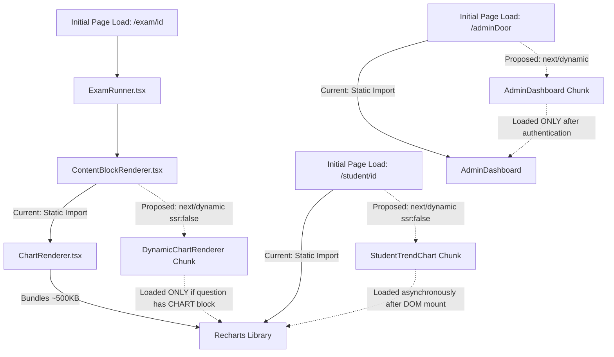

# Handoff Report: Survey & Technical Investigation for R5 & R6

- **Agent**: `teamwork_preview_explorer_survey_3`
- **Working Directory**: `C:\laragon\www\_MyCV\ExamPreparer\.agents\teamwork_preview_explorer_survey_3`
- **Milestone**: Survey & Technical Blueprint (Requirements R5 & R6)
- **Target Requirements**:
  - [[ORIGINAL_REQUEST]]: R5 (Dynamic Bundle Splitting & Asset Optimization)
  - [[ORIGINAL_REQUEST]]: R6 (Automated Testing & Zero-Regression Matrix)
- **Relevant Policies**: [[AGENTS]], ANTIGRAVITY SURGICAL PROTOCOL v4.0

---

## 1. Observation

### 1.1 Dependency & Stack Inventory
Directly inspected `package.json`, `next.config.ts`, `tsconfig.json`, and `vitest.config.ts`:
- **Next.js Engine**: `16.1.6` (Turbopack enabled)
- **React**: `19.2.3` / `react-dom: 19.2.3`
- **Visualization & Charting**: `recharts: ^3.7.0`, `jsxgraph: ^1.12.2`
- **Animation & Virtualization**: `animejs: ^4.5.0`, `@tanstack/react-virtual: ^3.14.2`, `katex: ^0.16.33`
- **Unused Dependency Identified**: `framer-motion: ^12.40.0` is in `package.json` line 19, but a global search (`grep_search`) confirmed **0 imports** across `src/`.
- **Test Runner & Mocks**: `vitest: ^4.1.11`, `fake-indexeddb: ^6.2.5`
- **Database / State**: `dexie: ^4.4.6`, `@supabase/supabase-js: ^2.98.0`

### 1.2 Recharts & Graphics Module Infiltration Points (R5)
Empirical code search revealed two primary ingestion sites for `recharts`:

1. **`src/components/exam/ChartRenderer.tsx` (Lines 1–81)**:
   - Direct static import of Recharts primitives:
     ```tsx
     import {
       BarChart, Bar, LineChart, Line, PieChart, Pie, Cell,
       XAxis, YAxis, CartesianGrid, Tooltip, ResponsiveContainer, Legend,
     } from 'recharts';
     ```
   - Imported directly into `src/components/exam/ContentBlockRenderer.tsx` at line 7:
     ```tsx
     import { ChartRenderer } from './ChartRenderer';
     ```
   - Rendered at lines 176–178:
     ```tsx
     case 'CHART':
       return <ChartRenderer block={block} />;
     ```
   - **Critical Leakage Chain**:
     `ContentBlockRenderer.tsx` is imported by:
     - `src/components/exam/ExamRunner.tsx` (Line 26) — The main student test execution cockpit.
     - `src/components/exam/QuestionRenderer.tsx` (Line 5) — Universal question card renderer.
     - `src/components/exam/StimulusRenderer.tsx` (Line 3) — Stimulus passage display.
     - `src/app/exam/[id]/review/page.tsx` (Line 7) — 50-question Review Studio.
     - `src/components/admin/EditorTab.tsx` (Line 5, via QuestionRenderer).
     - `src/components/admin/PrintModal.tsx` (Line 5, via QuestionRenderer).
   - **Impact**: Because `ContentBlockRenderer` statically imports `ChartRenderer`, every student loading `/exam/[id]` or `/exam/[id]/review` is forced to download the entire `recharts` bundle (~500 KB uncompressed) upfront, even when an exam contains 100% pure text/math questions with zero charts.

2. **`src/app/student/[id]/page.tsx` (Lines 6, 125–149)**:
   - Static import:
     ```tsx
     import { LineChart, Line, XAxis, YAxis, CartesianGrid, Tooltip as RechartsTooltip, ResponsiveContainer } from 'recharts';
     ```
   - Direct inline rendering of student historical learning trend:
     ```tsx
     <ResponsiveContainer width="100%" height="100%">
       <LineChart data={chartData} margin={{ top: 10, right: 15, left: -20, bottom: 0 }}>
         ...
       </LineChart>
     </ResponsiveContainer>
     ```
   - **Impact**: Recharts is statically baked into the primary student portfolio page chunk.

3. **`src/app/adminDoor/page.tsx` (Line 4)**:
   - Static import of `AdminDashboard`:
     ```tsx
     import { AdminDashboard } from '@/components/admin/AdminDashboard';
     ```
   - **Impact**: Unauthenticated users visiting the admin login portal (`/adminDoor`) download the entire `AdminDashboard`, `EditorTab`, `PrintModal`, and `AnalyticsTab` before even typing a password.

4. **`src/components/exam/DiagramRenderer.tsx` (Existing Best Practice)**:
   - Lines 16–20 demonstrate existing dynamic import pattern for `jsxgraph`:
     ```tsx
     JXG = (await import('jsxgraph')).default ?? await import('jsxgraph');
     ```
   - Only loaded client-side on-demand when a diagram block is present.

### 1.3 Baseline Automated Test Suite & Build Status (R6)
Directly executed test and build commands in workspace:
- **Test Command**: `npm run test` (`vitest run`)
  - Configuration: `vitest.config.ts` (environment: `node`, globals: `true`, alias `@/` -> `./src`)
  - Output:
    ```
    ✓ tests/randomizer.test.ts (2 tests)
    ✓ tests/anime.test.ts (2 tests)
    ✓ tests/parser.test.ts (15 tests)
    ✓ tests/mockSupabase.test.ts (5 tests)
    ✓ tests/dexieSync.test.ts (4 tests)

    Test Files  5 passed (5)
         Tests  28 passed (28)
      Duration  745ms
    ```
  - Result: **100% Pass Rate (28/28 tests passed)**.
  - Zero mock failures across IndexedDB Dexie sync, Supabase mock client, tip penalties, group randomizer, and 50-question mock parsing.

- **Build Command**: `npm run build` (`next build`)
  - Output:
    ```
    ▲ Next.js 16.1.6 (Turbopack)
    ✓ Compiled successfully in 10.2s
    ✓ Generating static pages using 7 workers (5/5) in 393.6ms
    Finalizing page optimization ...
    Route (app)
    ┌ ○ /
    ├ ○ /_not-found
    ├ ○ /adminDoor
    ├ ƒ /exam/[id]
    ├ ƒ /exam/[id]/review
    └ ƒ /student/[id]
    ```
  - Result: **Exit code 0, 0 TypeScript errors, 0 build failures**.

---

## 2. Logic Chain



### 2.1 Chunk Contamination & Elimination Mechanics
1. **The Infiltration Vector**: As observed in `ContentBlockRenderer.tsx:7`, importing `ChartRenderer` directly pulls all Recharts modules (`BarChart`, `PieChart`, `LineChart`, `ResponsiveContainer`) into the initial evaluation graph of `ContentBlockRenderer`. Because `ExamRunner` and `QuestionRenderer` consume `ContentBlockRenderer`, the exam runner bundle inherits the entire Recharts library.
2. **Dynamic Splitting Solution via `next/dynamic`**:
   - In `ContentBlockRenderer.tsx`, replace the static `import { ChartRenderer } from './ChartRenderer'` with `next/dynamic`.
   - Configure `{ ssr: false }`. Because `ContentBlockRenderer` is a client component (`'use client'`), `ssr: false` is valid in Next.js App Router and guarantees zero SSR hydration discrepancies.
   - Supply a lightweight skeleton fallback (`h-[260px] animate-pulse bg-muted/10`) to preserve intrinsic layout dimensions and prevent layout shifts when a chart loads.
3. **Student Portfolio Decoupling**:
   - Extract the Recharts `LineChart` in `src/app/student/[id]/page.tsx` (lines 125–149) into a dedicated component: `src/components/student/StudentTrendChart.tsx`.
   - In `src/app/student/[id]/page.tsx`, load `StudentTrendChart` via `dynamic(() => import(...), { ssr: false, loading: () => <ChartSkeleton /> })`.
   - Result: Student dashboard initial HTML and critical JS hydrate instantly; the chart renders asynchronously without blocking interactive metrics cards.
4. **Admin Portal Guarding**:
   - In `src/app/adminDoor/page.tsx`, lazily load `AdminDashboard` using `next/dynamic`. The unauthenticated login card will have a minimal bundle footprint.
5. **Zero-Regression Assurance (R6)**:
   - All 28 Vitest tests execute in a Node environment and target logic modules (`lib/parser.ts`, `lib/randomizer.ts`, `lib/db.ts`, `lib/batchSyncManager.ts`, `lib/mockSupabase.ts`).
   - Dynamic imports in UI components (`ContentBlockRenderer.tsx`, `student/[id]/page.tsx`) do NOT alter the AST or runtime behavior of `lib/parser.ts` or `lib/db.ts`.
   - Therefore, `npm run test` will continue to pass 28/28 with 0 regressions.

---

## 3. Caveats

1. **Next.js 16 App Router `ssr: false` Rule**:
   - `ssr: false` is strictly disallowed in Next.js Server Components. However, all target files (`ContentBlockRenderer.tsx`, `src/app/student/[id]/page.tsx`, `src/app/adminDoor/page.tsx`) contain the `'use client'` directive at line 1. Hence, `{ ssr: false }` is completely compliant.
2. **Container Dimension Discipline for Recharts**:
   - Recharts' `<ResponsiveContainer width="100%" height="100%">` relies on parent DOM bounding rects. When rendered client-side, the wrapper `div` must maintain explicit heights (e.g. `h-[260px]` for question charts, `h-[340px]` for student trend) to avoid 0px height rendering collapse.
3. **Vitest DOM Limitations**:
   - `vitest.config.ts` currently runs with `environment: 'node'`. No jsdom or `@testing-library/react` is configured. If future tests are created to assert DOM rendering of React components, a DOM environment (jsdom/happy-dom) would be required for those specific test files.

---

## 4. Conclusion & Actionable Blueprint

### 4.1 Implementation Blueprint for R5 (Dynamic Bundle Splitting)

#### Action 1: Dynamic Import in `src/components/exam/ContentBlockRenderer.tsx`
Replace static import with `next/dynamic`:
```tsx
// BEFORE (Line 7):
import { ChartRenderer } from './ChartRenderer';

// AFTER:
import dynamic from 'next/dynamic';

const DynamicChartRenderer = dynamic(
  () => import('./ChartRenderer').then((mod) => mod.ChartRenderer),
  {
    ssr: false,
    loading: () => (
      <div className="h-[260px] w-full flex flex-col items-center justify-center bg-muted/10 rounded-xl border border-dashed border-border/50 animate-pulse">
        <span className="text-xs text-muted-foreground font-medium">Memuat grafik data...</span>
      </div>
    ),
  }
);
```
In `ContentBlockRenderer`:
```tsx
// BEFORE (Lines 176-178):
case 'CHART':
  return <ChartRenderer block={block} />;

// AFTER:
case 'CHART':
  return <DynamicChartRenderer block={block} />;
```

#### Action 2: Extract & Dynamically Import Student Trend Chart
1. Create new component `src/components/student/StudentTrendChart.tsx`:
   - Contains the `ResponsiveContainer`, `LineChart`, `XAxis`, `YAxis`, `CartesianGrid`, `Tooltip`, `Line` logic from `src/app/student/[id]/page.tsx`.
   - Marked with `'use client'`.
2. In `src/app/student/[id]/page.tsx`:
   - Remove Recharts imports from line 6.
   - Import `StudentTrendChart` via `next/dynamic`:
     ```tsx
     const StudentTrendChart = dynamic(
       () => import('@/components/student/StudentTrendChart').then((m) => m.StudentTrendChart),
       {
         ssr: false,
         loading: () => (
           <div className="h-[340px] w-full flex flex-col items-center justify-center bg-muted/10 rounded-xl animate-pulse">
             <span className="text-xs text-muted-foreground">Memuat tren belajar...</span>
           </div>
         ),
       }
     );
     ```

#### Action 3: Lazy-Load Admin Dashboard in `src/app/adminDoor/page.tsx`
```tsx
// BEFORE (Line 4):
import { AdminDashboard } from '@/components/admin/AdminDashboard';

// AFTER:
import dynamic from 'next/dynamic';

const AdminDashboard = dynamic(
  () => import('@/components/admin/AdminDashboard').then((mod) => mod.AdminDashboard),
  {
    loading: () => (
      <div className="min-h-screen flex items-center justify-center bg-background">
        <div className="animate-pulse text-sm text-muted-foreground font-medium">Memuat Admin Dashboard...</div>
      </div>
    ),
  }
);
```

### 4.2 Verification Matrix for R6 (Automated Testing & Zero-Regression)

| Target Area | Test Suite File | Test Count | Key Invariants to Guard |
|---|---|---|---|
| Question Parsing | `tests/parser.test.ts` | 15 tests | Markdown formulas, Chart JSON schema (`[CHART:BAR]`), Diagram blocks, 50-question mock test with stimulus, Tip penalty calculation |
| Offline Persistence | `tests/dexieSync.test.ts` | 4 tests | Dexie `answersQueue`, `sessions`, `scratchpads`, offline submission batch synchronization |
| Exam Randomization | `tests/randomizer.test.ts` | 2 tests | Group-aware stimulus cohesion, question chain ordering |
| Animation Engine | `tests/anime.test.ts` | 2 tests | Object property tweening, `revert()` cleanup |
| Supabase Mocking | `tests/mockSupabase.test.ts` | 5 tests | Student lookup, attempt join queries, RPC `calculate_irt` simulation |
| Production Build | `npm run build` | Full Matrix | TypeScript type validation, Turbopack bundle synthesis, route tree health |

---

## 5. Verification Method

To independently verify these findings:

1. **Verify Baseline Tests**:
   ```bash
   npm run test
   ```
   - Expect: 5 test files passed, 28 tests passed, 0 failures.

2. **Verify Production Build**:
   ```bash
   npm run build
   ```
   - Expect: Next.js compile success with exit code 0.

3. **Verify Chunk Separation After R5 Implementation**:
   - Inspect `.next/static/chunks/` after `npm run build`.
   - Confirm that routes `/exam/[id]` and `/exam/[id]/review` do not include Recharts in their initial critical chunks, and that Recharts is isolated in an asynchronous dynamic chunk.

4. **Invalidation Conditions**:
   - If `npm run test` fails any of the 28 tests.
   - If `next build` emits TypeScript errors regarding dynamic import types.
   - If Recharts fails to render on client interaction due to missing height constraints.
