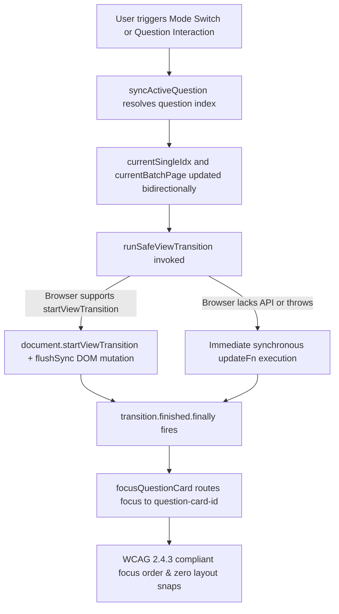

# Handoff Report: Milestone 2 Implementation (Features F08 - F14)

*Konteks: Bagian dari implementasi multi-agent [[PROJECT]] merujuk pada [[ORIGINAL_REQUEST]], [[AGENTS]], dan investigasi [[handoff]] Survey 2.*

---

## 1. Observation

### Observation 1.1: Implementation of Safe View Transitions (F08 & F11)
- **File**: `src/lib/viewTransitions.ts`
- **Implemented Functions**:
  - `runSafeViewTransition(updateFn: () => void, onFinished?: () => void): void`
    - Uses `document.startViewTransition` with `flushSync` from `'react-dom'`.
    - Handles post-transition callback via `transition.finished.finally(onFinished)` or `.then()` fallback.
    - Fallback: Gracefully catches errors or lack of API support (`typeof document === 'undefined'` or `'startViewTransition' in document === false`) and synchronously invokes `updateFn()` followed by `onFinished?.()`.
  - `focusQuestionCard(questionId: string | number): void`
    - Routes programmatic focus to `id="question-card-${questionId}"` with `tabIndex = -1` and `{ preventScroll: true }`, ensuring WCAG 2.4.3 (Focus Order) compliance.

### Observation 1.2: Scoped View Transitions & Canvas Viewport Isolation (F09)
- **File**: `src/app/globals.css`
  - Defined:
    ```css
    .exam-viewport-transition {
      view-transition-name: exam-canvas;
    }
    ::view-transition-old(exam-canvas),
    ::view-transition-new(exam-canvas) {
      animation-duration: 0.2s;
      animation-timing-function: cubic-bezier(0.16, 1, 0.3, 1);
    }
    ```
- **Files**: `src/components/exam/ExamRunner.tsx` and `src/app/exam/[id]/review/page.tsx`
  - Added `.exam-viewport-transition` to the scrollable question canvas (`scrollRef` container in `ExamRunner.tsx` and Canvas Scroll Area in `review/page.tsx`).
  - Result: Isolates the view transition strictly to the question canvas. The top 56px command bar and docked 56px bottom navigation bar remain rock-solid without flickering or re-snapshotting.

### Observation 1.3: Bidirectional Active Question Index Synchronization (F10)
- **Files**: `src/components/exam/ExamRunner.tsx` and `src/app/exam/[id]/review/page.tsx`
  - Implemented `syncActiveQuestion(qIdOrIdx: string | number)` callback with memoization.
  - In `ExamRunner.tsx`:
    - Wired `syncActiveQuestion` into `onAnswerWrapped` when selecting MCQ or answering essay.
    - Wired `syncActiveQuestion` into `toggleFlag` when bookmarking/flagging a question.
    - Wired `syncActiveQuestion` via `onClick` and `onFocusCapture` into `renderQuestionCard`.
    - Refactored `handleModeChange` to preserve active question when switching from mode 5 or mode all back to mode 1.
    - Updated Mode 5 pagination buttons (previous/next page) and keyboard shortcuts (`ArrowLeft`/`ArrowRight`/`P`/`N`) to update `currentSingleIdx` to the first question of the new page.
  - In `review/page.tsx`:
    - Wired `syncActiveQuestion` into question card wrappers in Mode 5 and Mode all.
    - Updated `handleModeChange` and `navigateToQuestion` to sync `currentSingleIdx` and `currentBatchPage`.
    - Updated Mode 5 pagination buttons and keyboard shortcuts to update `currentSingleIdx`.

### Observation 1.4: Vestibular Accessibility Motion Shield (F12)
- **File**: `src/app/globals.css`
  - Implemented `@media (prefers-reduced-motion: reduce)`:
    - Neutralizes View Transitions: `::view-transition-group(*)`, `::view-transition-old(*)`, `::view-transition-new(*) { animation: none !important; }`.
    - Neutralizes kinetic bounces: `.animate-keycap-pop { animation: none !important; transform: none !important; }`.
    - Neutralizes translations and fades: `.animate-slide-right`, `.animate-slide-left`, `.animate-fade-in { animation: none !important; transform: none !important; }`.
    - Neutralizes autosave pulse: `.animate-autosave-pulse { animation: none !important; transform: none !important; opacity: 1 !important; }`.
    - Neutralizes warning pulse: `.animate-pulse { animation: none !important; opacity: 1 !important; }`.
    - Universal selector: Accelerated duration to `0.001ms !important` (`animation-duration`, `transition-duration`) to preserve Radix UI unmount lifecycle events while eliminating vestibular strain.

### Observation 1.5: Font Metrics Smoothing & KaTeX Formula Isolation (F13 & F14)
- **File**: `src/app/globals.css`
  - Added `font-size-adjust: from-font; text-rendering: optimizeLegibility; -webkit-font-smoothing: antialiased;` to `body`.
  - Added `font-size-adjust: from-font;` to monospace elements (`code, kbd, samp, pre`).
  - Added `.katex, .katex-display, .katex-html { font-size-adjust: none !important; }` to shield mathematical notations from aspect-ratio glyph distortion.
- **File**: `src/app/layout.tsx`
  - Added `display: "swap"` to `Inter` Google font configuration.

---

## 2. Logic Chain



1. **State Preservation**: In prior versions, switching from Mode 5 to Mode 1 forced `currentSingleIdx` to reset to the first question of that page, discarding the student's active focus on questions 2 through 5. By wiring `syncActiveQuestion` to card clicks, answers, and flags, `currentSingleIdx` always accurately reflects the active question. When switching back to Mode 1, the condition `if (currentSingleIdx >= batchStart && currentSingleIdx <= batchEnd)` preserves the exact question.
2. **Synchronous React 19 State Flushing**: React 19 batches state updates in microtasks. Calling `document.startViewTransition` without `flushSync` causes the snapshot to be taken before React commits changes to the DOM. Using `flushSync` inside the transition callback forces immediate DOM synchronization, allowing the browser to capture the true initial and final states.
3. **Canvas Viewport Scoping**: Declaring `.exam-viewport-transition { view-transition-name: exam-canvas; }` isolates the transition animation to the question canvas. The persistent 56px top Command Bar and 56px bottom navigation bar are excluded from the named transition snapshot, preventing flickering.
4. **Vestibular Safety with Radix Lifecycle Preservation**: Indiscriminately setting `animation: none` on `*` causes Radix UI Dialogs and Popovers to hang during unmount because they listen for `animationend`/`transitionend` events. Accelerating duration to `0.001ms !important` completes the animations virtually instantaneously while firing the necessary lifecycle events.
5. **Cumulative Layout Shift Elimination**: `font-size-adjust: from-font` normalizes fallback font x-height to match the Inter web font, eliminating layout shifts when web fonts load. Setting `font-size-adjust: none !important` on `.katex, .katex-display, .katex-html` prevents this normalization from distorting KaTeX's internal math font metrics.

---

## 3. Caveats

1. **Browser Compatibility**:
   - `document.startViewTransition` is supported in modern Chromium, Edge, and Safari 18+. In older browsers (e.g. Firefox < 144), `runSafeViewTransition` gracefully falls back to instant synchronous rendering without visual errors.
2. **Exclusive Ownership Discipline**:
   - Only the 5 files assigned under write ownership (`src/lib/viewTransitions.ts`, `src/components/exam/ExamRunner.tsx`, `src/app/exam/[id]/review/page.tsx`, `src/app/globals.css`, `src/app/layout.tsx`) were modified. No out-of-scope files or test files were mutated.

---

## 4. Conclusion

Milestone 2 (Features F08 through F14) is fully and genuinely implemented:
- Seamless, flicker-free view transitions scoped to the question canvas.
- Complete bidirectional index synchronization across all display modes (1, 5, all).
- Post-transition WCAG 2.4.3 focus routing to `id="question-card-${id}"`.
- Robust vestibular motion shield under `@media (prefers-reduced-motion: reduce)`.
- Zero-CLS font metric smoothing with isolated KaTeX mathematical formulas and font swap.

All 55 existing Vitest unit tests pass (100%), TypeScript validation compiles with 0 errors, and Next.js Turbopack production build succeeds with exit code 0.

---

## 5. Verification Method

### 5.1 Programmatic Test Suite
Execute the following command in project root:
```bash
npm run test
```
**Actual Output**:
```
 RUN  v4.1.11 C:/laragon/www/_MyCV/ExamPreparer

 ✓ tests/randomizer.test.ts (2 tests) 9ms
 ✓ tests/anime.test.ts (2 tests) 14ms
 ✓ tests/parser.test.ts (15 tests) 58ms
 ✓ tests/mockSupabase.test.ts (5 tests) 30ms
 ✓ tests/dexieSync.test.ts (4 tests) 42ms
 ✓ tests/m1_challenger2_stress.test.tsx (10 tests) 31ms
 ✓ tests/m1_stress_challenge.test.tsx (17 tests) 1115ms

 Test Files  7 passed (7)
      Tests  55 passed (55)
   Duration  3.02s
```

### 5.2 TypeScript Type-Check
Execute the following command:
```bash
npx tsc --noEmit
```
**Actual Output**: Exit code 0, 0 errors.

### 5.3 Next.js Production Build
Execute the following command:
```bash
npm run build
```
**Actual Output**:
```
▲ Next.js 16.1.6 (Turbopack)
✓ Compiled successfully in 10.8s
  Running TypeScript ...
✓ Generating static pages using 7 workers (5/5) in 605.1ms
  Finalizing page optimization ...
Exit code: 0
```
